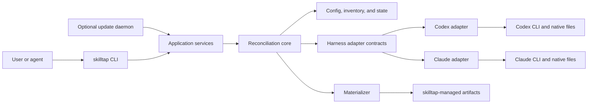
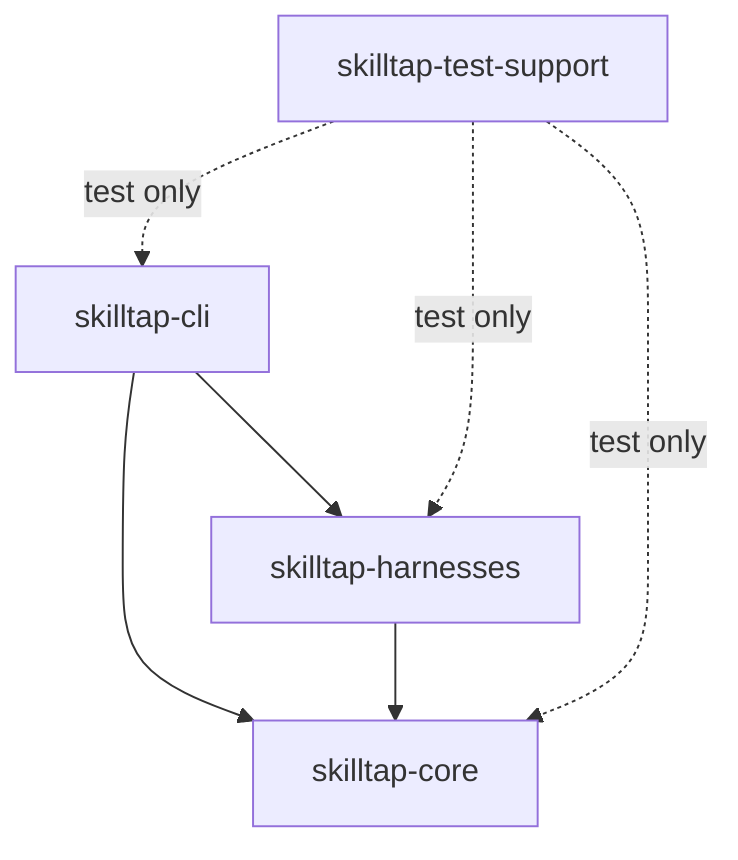
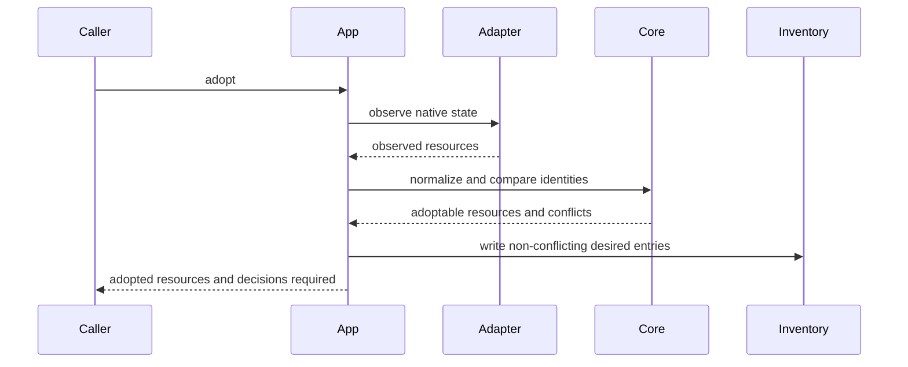
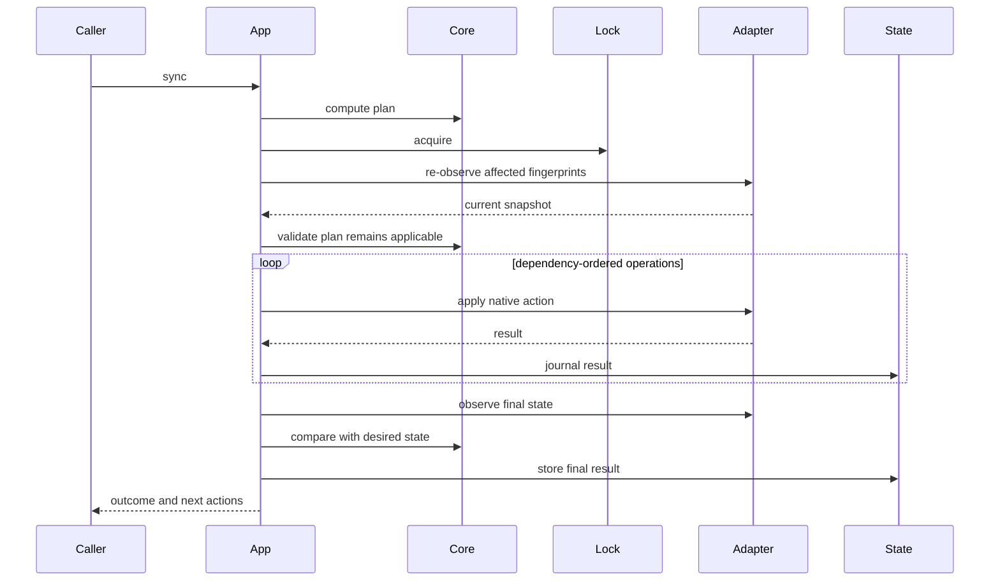
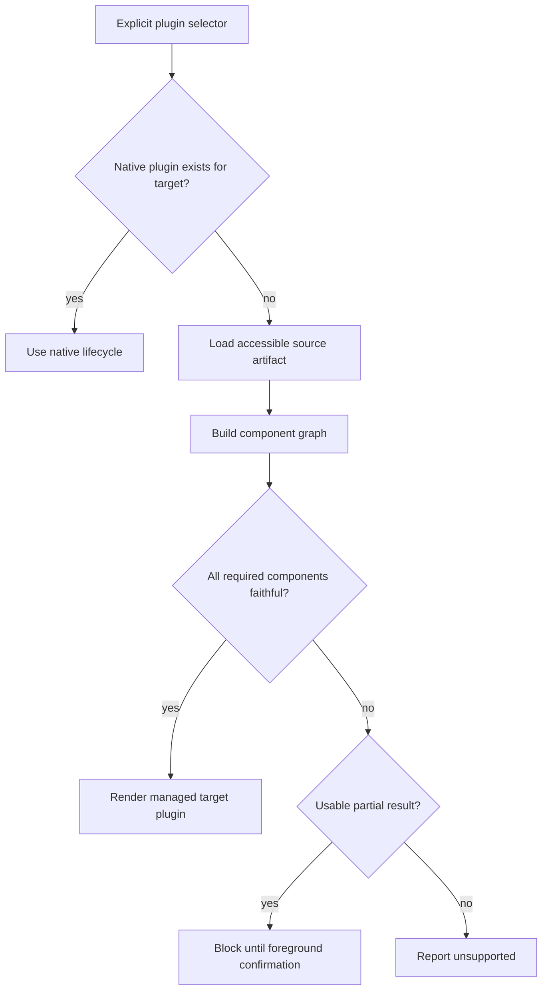
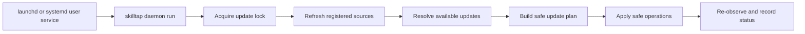

# Architecture

skilltap is a Rust CLI with a pure reconciliation core, native harness adapters, and a thin command layer.

The architecture separates normalized intent from harness-specific behavior. Codex and Claude Code remain authoritative for their native formats and lifecycle operations.

## System Context



The CLI and daemon call the same application services. There is no separate automation behavior or daemon-specific reconciliation path.

## Workspace

```text
skilltap/
├── Cargo.toml
├── crates/
│   ├── core/
│   │   └── src/
│   ├── harnesses/
│   │   └── src/
│   ├── cli/
│   │   └── src/
│   └── test-support/
│       └── src/
├── docs/
└── tests/
```

### `skilltap-core`

The core library contains domain types, configuration and inventory schemas, operational state schemas, compatibility classification, reconciliation, planning, materialization rules, instruction management, update resolution, and application service contracts.

The core has no dependency on CLI parsing, terminal output, Codex, Claude, `launchd`, or `systemd`.

### `skilltap-harnesses`

The harness library implements Codex and Claude Code observation and lifecycle operations, native manifest parsing, native command invocation, runtime capability detection, harness-version compatibility, and user-service integration for `launchd` and `systemd --user`.

It depends on core contracts. Core does not depend on concrete harness adapters.

### `skilltap-cli`

The CLI crate contains `clap` command definitions, argument validation, human-readable and JSON rendering, exit-code mapping, composition of storage and adapter implementations, and the `skilltap` binary entry point.

Command handlers contain no reconciliation or native-format business logic.

### `skilltap-test-support`

Test support provides temporary home and configuration directories, fake Codex and Claude binaries, native-output fixtures, Git repository fixtures, marketplace, plugin, and skill fixtures, filesystem assertions, and compiled-binary command helpers.

Production crates never depend on test support.

## Dependency Direction



Dependencies point toward the domain. Native harness details cannot leak into normalized domain types unless they are stored as opaque adapter metadata.

## Domain Model

The core model centers on a resource graph.

```text
Environment
├── Harness
├── Marketplace
├── Plugin
│   └── Component
│       ├── Skill
│       ├── MCP server
│       ├── Hook
│       ├── Agent
│       ├── App or connector
│       ├── LSP server
│       └── Harness-specific component
├── Standalone skill
└── Instruction location
```

Every managed resource has a stable skilltap identity, desired target harnesses, native identities per harness, scope, source identity, provenance, compatibility, update policy, last-applied fingerprint, and dependency relationships.

Harness-specific metadata is namespaced and opaque to the general planner. Only the owning adapter interprets it.

## Core Types

The core defines validated types for:

- `HarnessId`
- `ResourceId`
- `ResourceKind`
- `Scope`
- `Source`
- `DesiredResource`
- `ObservedResource`
- `Provenance`
- `Capability`
- `Compatibility`
- `Fingerprint`
- `ResolvedRevision`
- `Plan`
- `Operation`
- `OperationDependency`
- `ApplyResult`
- `AttentionReason`

Raw strings do not represent resource identifiers, revisions, canonical paths, or compatibility states inside the domain.

## Harness Adapter Contract

Each harness adapter implements behavior equivalent to:

```rust
trait HarnessAdapter {
    fn id(&self) -> HarnessId;
    fn detect(&self) -> Result<HarnessInstallation, HarnessError>;
    fn capabilities(
        &self,
        installation: &HarnessInstallation,
    ) -> Result<CapabilitySet, HarnessError>;
    fn observe(
        &self,
        request: &ObservationRequest,
    ) -> Result<ObservedEnvironment, HarnessError>;
    fn resolve_native_action(
        &self,
        operation: &SemanticOperation,
    ) -> Result<NativeAction, HarnessError>;
    fn apply(
        &self,
        action: &NativeAction,
    ) -> Result<NativeApplyResult, HarnessError>;
}
```

The exact Rust signatures may differ, but the responsibilities remain separate:

- The core decides what semantic change is needed.
- The adapter decides whether and how the harness can perform it natively.
- The executor performs the resolved native action.
- The adapter observes the result.
- The core determines whether desired state was reached.

Adapters never mutate during observation or capability detection.

## Capability Detection

Harness support is runtime-versioned.

An adapter locates the configured binary, reads its version, probes documented machine-readable commands where necessary, selects a known capability profile, and reports unsupported or unverified capabilities explicitly.

A newer unknown harness version may use capabilities that remain contract-compatible, but skilltap does not assume undocumented mutation behavior.

The maintained capability profiles and native contracts live in [HARNESS-CONTRACTS.md](./HARNESS-CONTRACTS.md).

## Storage

Storage is divided by purpose:

- `config.toml` contains operating policy.
- `inventory.toml` contains human-readable desired resources.
- `state.json` contains machine-written observations and provenance.
- `managed/` contains skilltap-owned artifacts and recoverable backups.

Schemas are versioned independently.

Storage implementations expose repositories such as `ConfigRepository`, `InventoryRepository`, `StateRepository`, and `ManagedArtifactRepository`.

All writes validate the complete replacement document before atomically replacing the previous file.

Unknown fields in skilltap-owned schemas are rejected. Unknown documented native fields are preserved when a native file must be edited.

## Observation

Observation produces a normalized snapshot without changing the machine.

Each adapter reads native CLI JSON output where available, documented native configuration, installed resource manifests, managed artifact fingerprints, and harness and plugin versions.

Observations include malformed and unmanaged resources as health findings rather than silently omitting them.

`status`, `adopt`, `plan`, and `sync` share the same observation pipeline.

## Adoption Flow



Adoption writes inventory and provenance only. It never invokes native mutation.

## Planning

The planner is pure with respect to external state. Its inputs are desired inventory, last-applied state, fresh observations, harness capability sets, compatibility evidence, requested targets and selectors, and user acknowledgment flags.

The planner emits a dependency graph of semantic operations classified as safe native, safe faithful equivalent, safe materialization, partial and acknowledgment-required, unsupported, conflict, or no-op.

A plan contains enough information for human and JSON renderers without exposing adapter-internal implementation objects.

## Apply Flow



The executor stops dependent operations after failure. Independent completed operations remain recorded.

skilltap does not claim cross-harness atomicity. Recovery consists of re-observation and a new plan.

## Native Command Execution

Native CLIs are invoked with an executable plus an argument vector. skilltap does not construct shell command strings.

The command runner captures exit status, standard output, standard error, duration, harness version, and a parsed structured result when available.

Secrets from environment variables or native configuration are never copied into logs or state.

Native commands use their JSON mode where documented. Human-oriented output is parsed only when no structured contract exists, and such parsing is version-gated.

## Plugin Resolution

Plugin installation follows this decision path:



The component graph preserves source dependencies. Omission of a required component blocks the complete resource.

Materialized plugins live under `managed/` and are registered with the target through a documented native mechanism. Harness caches are never used as a write API.

## Standalone Skills

A standalone skill is always modeled as a complete directory tree rooted at a directory containing `SKILL.md`.

The source resolver:

1. Resolves the explicit local or Git source.
2. Applies an explicit subdirectory when supplied.
3. Verifies that `SKILL.md` exists at the resolved root.
4. Validates frontmatter.
5. Fingerprints the complete directory tree.
6. Records the source and resolved Git SHA.
7. Installs or links the complete tree.

The resolver does not recursively discover candidate skills.

Git-backed updates compare the stored resolved SHA with the current SHA of the requested ref. Local modifications are detected by comparing the complete tree fingerprint with last-applied state.

## Compatibility Analysis

Compatibility analysis combines standard skill metadata, harness-specific metadata, plugin component types, declared dependencies, known harness path variables, target adapter capabilities, and complete artifact structure.

Every classification carries evidence. The planner uses classifications rather than reinterpreting raw manifests.

Heuristics may produce `unknown`; they never produce a false claim of faithful equivalence.

## Instruction Management

Instruction management treats `~/AGENTS.md` as canonical global content and project-root `AGENTS.md` as canonical project content. Harness-native global files and project `CLAUDE.md` files are bridges.

The instruction service resolves global, project, and explicitly adopted nested locations; inspects links without following them for ownership; compares resolved targets separately; creates relative symlinks where practical; supports Claude imports such as `@~/AGENTS.md`; preserves user-authored content; stores backups before approved replacement; and reports conflicts through the standard planning model.

Instruction files are not copied into skilltap inventory. Inventory tracks their location, ownership, bridge mode, and fingerprints.

## Updates

The update resolver operates only on managed resources with explicit upstream identity.

For plugins, it asks the native adapter or registered marketplace for the available version or source revision. For Git-backed skills, it resolves the requested ref and compares commit SHAs.

An update becomes an ordinary reconciliation plan containing the old and new revision, artifact changes, compatibility changes, required rematerialization, native target actions, and drift or conflict blockers.

Foreground and daemon updates use the same planner and executor.

## Optional Daemon

The daemon is an alternate entry point to one update-cycle application service. It has no additional mutation authority.



The daemon never supplies user acknowledgment. Partial updates, local drift, and conflicts remain pending.

The service runs without elevated privileges. Its service definition contains no secrets. Disabling the daemon removes only skilltap's user-service definition.

## Concurrency

A process-wide configuration lock serializes mutating operations across CLI and daemon processes.

Read-only commands may run concurrently. A reader sees either the old or new complete state document, never a partially written file.

Before applying a plan, the writer verifies that affected observations still match the fingerprints used during planning.

## Error Model

Errors are typed by boundary:

- Configuration error.
- Inventory error.
- State error.
- Source error.
- Harness detection error.
- Harness contract error.
- Compatibility error.
- Conflict.
- Native operation error.
- Filesystem error.
- Partial apply error.
- Daemon integration error.

Core libraries return typed results and never write to stdout or stderr.

Errors contain structured context suitable for both human and JSON rendering.

## Testing

### Unit tests

Pure tests cover identity normalization, capability matching, compatibility classification, plan construction, dependency ordering, selector behavior, update resolution, and exit-result classification.

### Adapter contract tests

Each harness adapter runs against recorded native JSON and filesystem fixtures covering supported harness versions.

### Integration tests

Temporary homes and fake harness binaries verify adoption without native mutation, native plugin lifecycle invocation, complete-directory skill installation, Git-SHA updates, instruction setup and repair, drift handling, partial failure recovery, daemon update cycles, and JSON output.

### End-to-end tests

The compiled `skilltap` binary runs against isolated temporary environments.

Every mutating workflow includes an idempotency assertion: the same operation immediately repeated produces no changes.

Property tests cover reconciliation invariants and dependency-graph ordering where useful.

## Technology

The implementation uses stable Rust.

Primary library categories are:

- `clap` for CLI parsing.
- `serde`, `toml`, and `serde_json` for validated serialization.
- A typed error library such as `thiserror`.
- A cryptographic hash library for artifact fingerprints.
- Filesystem locking and temporary-file libraries with macOS and Linux support.

The architecture does not require an async runtime. Native processes, filesystem operations, Git resolution, and daemon update cycles are synchronous unless measured behavior establishes a need for concurrency.
